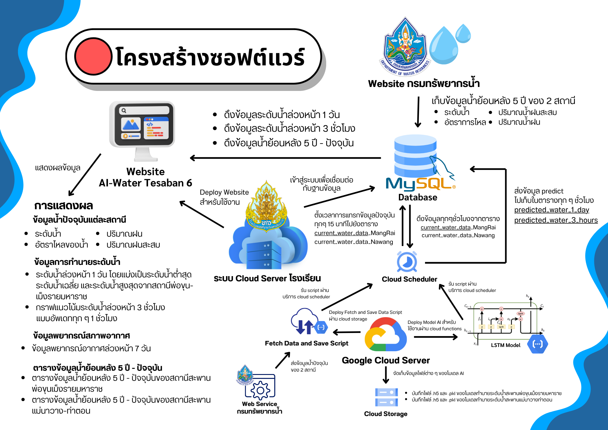

# SmartFloodAI: LSTM-Based Flood Forecasting & Alert System


**SmartFloodAI** เป็นระบบคาดการณ์และแจ้งเตือนน้ำท่วมล่วงหน้า พัฒนาขึ้นเพื่อช่วยให้ชุมชนสามารถเตรียมพร้อมรับมือกับอุทกภัย โดยใช้โมเดล Deep Learning (LSTM) ในการวิเคราะห์ข้อมูลระดับน้ำจาก Web Service API ของรัฐบาล เพื่อคาดการณ์แนวโน้มระดับน้ำในอนาคต และแจ้งเตือนประชาชนผ่าน Line Chatbot โดยสามารถเข้าไปดูเว็บไซต์ได้ที่ https://ai-water.tesaban6.ac.th/

---

## 🏛️ System Architecture

ระบบถูกออกแบบมาให้ทำงานแบบ Full-Stack โดยมีการแบ่งส่วนการทำงานที่ชัดเจนระหว่าง Cloud (GCP) และ On-Premise Server (AppServ) เพื่อความปลอดภัยของข้อมูล

<p align="center">
    
</p>

1.  **Data Ingestion (GCP):** **Google Cloud Scheduler** สั่งรัน **Google Cloud Function** (Python) ทุก 15 นาที
2.  **Data Processing (Python):** สคริปต์ Python ดึงข้อมูลจาก API รัฐบาล, ทำ Data Cleaning, และประมวลผลข้อมูล
3.  **Secure API Call:** Python **ส่ง (POST)** ข้อมูลที่ประมวลผลแล้วไปยัง **PHP API Endpoint** ที่รันอยู่บนเซิร์ฟเวอร์ AppServ (เชื่อมต่อผ่าน **Secure HTTP Tunnel** เพื่อไม่ให้ Public Port)
4.  **Database Storage (PHP/AppServ):** **PHP API** ทำหน้าที่เป็น Backend ตรวจสอบข้อมูล (Validate) และบันทึกข้อมูลลงในฐานข้อมูล **MySQL**
5.  **Predictive Modeling (GCP):** สคริปต์ Python อีกตัว (รันตามรอบเวลา) ดึงข้อมูลจากฐานข้อมูล (ผ่าน PHP API) มาประมวลผลผ่านโมเดล **LSTM** เพื่อคาดการณ์ระดับน้ำล่วงหน้า 3 ชั่วโมง
6.  **Prediction Storage:** ผลการคาดการณ์จะถูกส่งกลับไปบันทึกยัง **MySQL** (ผ่าน PHP API เดิม)
7.  **Web Dashboard (React):** Frontend ของ React ดึงข้อมูลสถิติและผลการคาดการณ์จาก **PHP API** (อีก Endpoint หนึ่ง) เพื่อนำมาแสดงผลเป็นกราฟ
8.  **Alert System:** ระบบ (อาจจะเป็น Python หรือ PHP) ตรวจสอบผลการคาดการณ์ในฐานข้อมูล หากถึงเกณฑ์ที่กำหนด จะส่งการแจ้งเตือนผ่าน **Line Messaging API**

---

## ✨ Key Features

* **LSTM-Based Forecasting:** คาดการณ์ระดับน้ำล่วงหน้าด้วยโมเดล Time-Series ที่มีความแม่นยำ
* **Real-Time Dashboard:** Web UI (React + Tailwind) แสดงผลข้อมูลระดับน้ำปัจจุบันและกราฟคาดการณ์
* **Secure Hybrid Architecture:** แยกส่วน ML (บน Cloud) และ Database (On-premise) ออกจากกันอย่างชัดเจน
* **Secure Connection:** เชื่อมต่อกับฐานข้อมูล on-premise (เช่น ของโรงเรียน) อย่างปลอดภัยผ่าน **HTTP Tunneling** และ **Reverse Proxy** โดยไม่ต้องเปิด Public Port
* **Automated Workflow:** ใช้ Google Cloud Scheduler ในการรันระบบทั้งหมด

---

## 🛠️ Technology Stack

* **Backend (AI/ML - GCP):** **Python**, **TensorFlow/Keras** (สำหรับ LSTM Model), **Pandas** (สำหรับจัดการข้อมูล), **Scikit-Learn** (สำหรับ Data Preprocessing)
* **Backend (API/Database - AppServ):** **PHP**, **MySQL**, AppServ
* **Frontend:** **React**, Tailwind CSS
* **DevOps & Services:** Google Cloud Scheduler, Google Cloud Functions, Line Messaging API, Secure HTTP Tunneling
* **Core Libraries:** `requests` (Python), `numpy` (Python)

---

## ⚙️ Setup & Installation

โปรเจคนี้แบ่งเป็น 3 ส่วนหลัก: Python Backend (GCP), PHP API (AppServ), และ React Frontend

1.  **Clone the repository:**
    ```bash
    git clone [https://github.com/KitzSonx/SmartFloodAI.git](https://github.com/KitzSonx/SmartFloodAI.git)
    cd SmartFloodAI
    ```

### 2. Backend Setup (Python - GCP)

ส่วนนี้คือสคริปต์ที่รันบน Google Cloud Functions

```bash
cd backend/01_data_ingestion_gcp
pip install -r requirements.txt
```
* **Environment Variables:** สร้างไฟล์ `.env` (สำหรับรัน local) หรือตั้งค่า Environment Variables บน GCP โดยอ้างอิงจาก `backend/.env.example`:
    ```ini
    # .env.example (สำหรับ Python)

    # Endpoint ของ PHP API บน AppServ (ผ่าน Tunnel)
    PHP_ENDPOINT_URL=https://your-secure-tunnel-address/api_insert_data.php

    # API Key สำหรับยืนยันตัวตนกับ PHP API (เพื่อความปลอดภัย)
    PHP_API_KEY=YOUR_SECRET_KEY_FOR_PHP

    # (ถ้ามี) คีย์สำหรับ Line Bot
    LINE_CHANNEL_ACCESS_TOKEN=yyy
    ```

### 3. Backend Setup (PHP - AppServ)

ส่วนนี้คือ API ที่รันบน AppServ เพื่อเชื่อมต่อกับ MySQL

1.  อัปโหลดไฟล์ใน `backend_php_api/` ไปยังเซิร์ฟเวอร์ AppServ ของคุณ
2.  **Database Setup:** Import `database/schema.sql` ไปยัง MySQL Server (เช่น ผ่าน phpMyAdmin)
3.  **Connection Config:** สร้างไฟล์ `config.php` (จาก `config.example.php`) เพื่อใส่ข้อมูลการเชื่อมต่อฐานข้อมูลจริง
    *ไฟล์ `config.example.php`:*
    ```php
    <?php
    // config.example.php
    define('MYSQL_HOST', 'localhost');
    define('MYSQL_USER', 'your_database_username');
    define('MYSQL_PASSWORD', 'YOUR_SECRET_PASSWORD_HERE');
    define('MYSQL_DB', 'flood_db');
    
    // API Key ที่ต้องตรงกับฝั่ง Python
    define('EXPECTED_API_KEY', 'YOUR_SECRET_KEY_FOR_PHP');
    
    $conn = mysqli_connect(MYSQL_HOST, MYSQL_USER, MYSQL_PASSWORD, MYSQL_DB);
    ?>
    ```
    *(**หมายเหตุ:** ไฟล์ `config.php` จริง ควรถูกเพิ่มใน `.gitignore`)*


### 4. Frontend Setup (React)

```bash
cd frontend
npm install
npm start
```
* (อย่าลืมแก้ไข URL ของ API ในโค้ด React ให้ชี้ไปยัง `api_get_react.php` บนเซิร์ฟเวอร์ AppServ ของคุณ)

---

## 🚀 Future Improvements

* [ ] เพิ่มแหล่งข้อมูล (เช่น สภาพอากาศ, ปริมาณน้ำฝน) เพื่อเพิ่มความแม่นยำ
* [ ] พัฒนา LLM Chatbot ให้สามารถตอบคำถามเกี่ยวกับสถานการณ์น้ำได้
* [ ] ปรับปรุงโมเดล LSTM ให้ซับซ้อนยิ่งขึ้น (เช่น Stacked LSTM, Bi-LSTM)

---

## 📄 License

This project is licensed under the MIT License.
